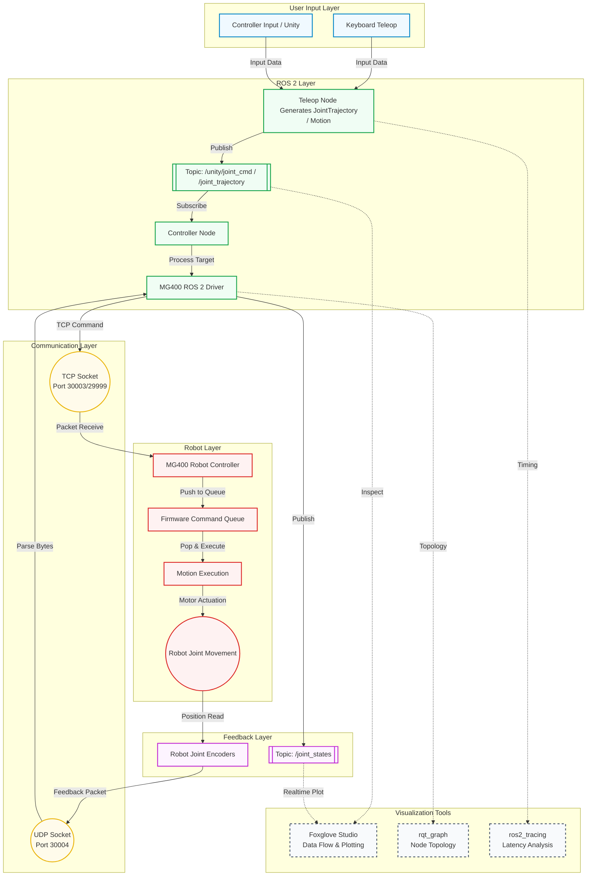
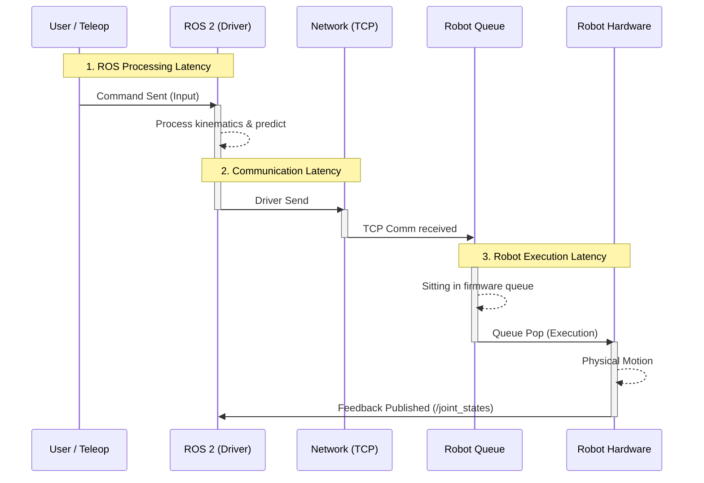

# Dobot MG400 Teleoperation System Architecture & Data Flow

This document details the data flow and latency analysis pipeline for the Dobot MG400 Teleoperation System, running on Ubuntu 24.04 and ROS 2 Jazzy.

## System Architecture & Data Flow Pipeline

## Latency Analysis Timeline

To debug teleoperation lag, the system latency is broken down into three critical segments:

1. **ROS 2 Processing Latency:** Time from when `Teleop Node` receives the user input to when the `MG400 Driver` is ready to send it over network.
2. **Communication Latency:** Network overhead of transmitting the command via TCP to the actual Robot hardware.
3. **Robot Execution Latency:** Time spent sitting in the hardware firmware queue before the actual physical motion begins.

## Summary for Debugging Lag

- **If ROS 2 Processing is slow:** Check `ros2_tracing` for blocked callbacks, high CPU utilization, or single-threaded executor deadlocks.
- **If Network Communication is slow:** Check for Nagle's algorithm being enabled (`TCP_NODELAY` off), packet loss, or high latency over Wi-Fi vs Ethernet.
- **If Robot Execution is slow:** Check if the Queue depth is too large (stale commands piling up). Implement dynamic dropping (gatekeeper) before sending commands to bound the queue size.
